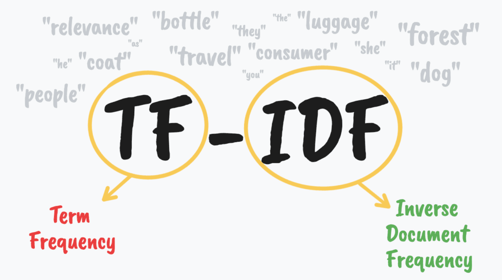

# NPL (Natural Language Processing)
En este repositorio se encuentran los desafíos propuestos por la materia de Procesamiento del Lenguaje Natural de la Carrera de Especialización en IA de la FIUBA.

## Desafío 1 _ Vectorización 

 
En este desafío se busca realizar la vectorización de documentos utilizando el método TF-IDF (Term Frequency-Inverse Document Frequency). Se busca analizar la similaridad entre los documentos mediante la distancia coseno, asi como clasificarlos utilizando Naive Bayes (Multinomial y ComplementNB). Por último, se propone una representación vectorizada de los términos del corpus trasponiendo la matriz documento-término.  

Link: [Notebook Desafío 1](https://github.com/valentinPertierra/LSE_NLP/blob/main/Desafio%201/Desafio_1.ipynb)

## Desafío 2 _ Word Embeddings
 
En este desafío se busca obtener una representación vectorial de los términos de un corpus (embeddings) utilizando modelos Word2Vect. Se entrenaron y compararon dos modelos Word2Vect, CBOW y Skip-Gram. Se analizaron las similitudes entre términos de interés en el espacio de embbedings y se implementó un test de analogías. Por último, se graficaron los embeddings en 2D y 3D utilizando técnicas de reducción de dimensionalidad.  Para este trabajo se utilizó el libro de "El Señor de los Anillos" como corpus.      

Link: [Notebook Desafío 2](https://github.com/valentinPertierra/LSE_NLP/blob/main/Desafio%202/Desafio_2.ipynb)

## Desafío 3 _ Modelos de Lenguaje
 
En este trabajo se implementaron y compararon varios modelos de lenguaje, con tokenización por caracteres, para la generación de texto utilizando arquitecturas de redes neuronales recurrentes, en particular Simple RNN, LSTM y GRU. Se generaron nuevas secuencias de texto de manera autorregresiva, a partir de secuencias de contexto, utilizando estrategias de greedy search y beam search determístico y estocástico. Para este trabajo se utilizó el libro de "El Señor de los Anillos" como corpus.

Link: [Notebook Desafío 3](https://github.com/valentinPertierra/LSE_NLP/blob/main/Desafio%203/Desafio_3.ipynb)

## Desafío 4 _ Chatbot QA
 
Se implemento un chatbot de preguntas y respuestas a partir de una arquitectura del tipo Seq2Seq encoder-decoder basado en redes LSTM, utilizando la capa de embedding pre-entrenada de FastText. Como dataset se utilizaron los datos disponibles del challenge ConvAI2 (Conversational Intelligence Challenge 2) de conversaciones en inglés.

Link: [Notebook Desafío 4](https://github.com/valentinPertierra/LSE_NLP/blob/main/Desafio%204/Desafio_4.ipynb)

## Desafío 5 _ Sentiment Analysis
     
Se desarrollo un modelo de Sentiment Analysis utilizando como backbone la arquitectura de BERT (Bidirectional Encoder Representations from Transformers). Como dataset se utilizaron las reseñas de usuario de Google Apps con la intención de clasificarlas en 5 categorías. En primer lugar, se utilizó la estructura de BERT como feature extractor, donde solo de entreno la capa fully connected del clasificador. Luego se realizo un finetuning con todos los parámetros entrenables.

Link: [Notebook Desafío 5](https://github.com/valentinPertierra/LSE_NLP/blob/main/Desafio%205/Desafio_5.ipynb)
